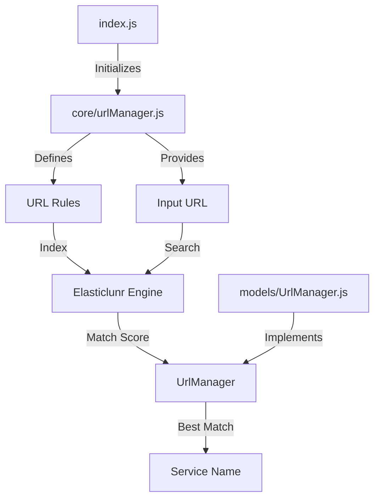
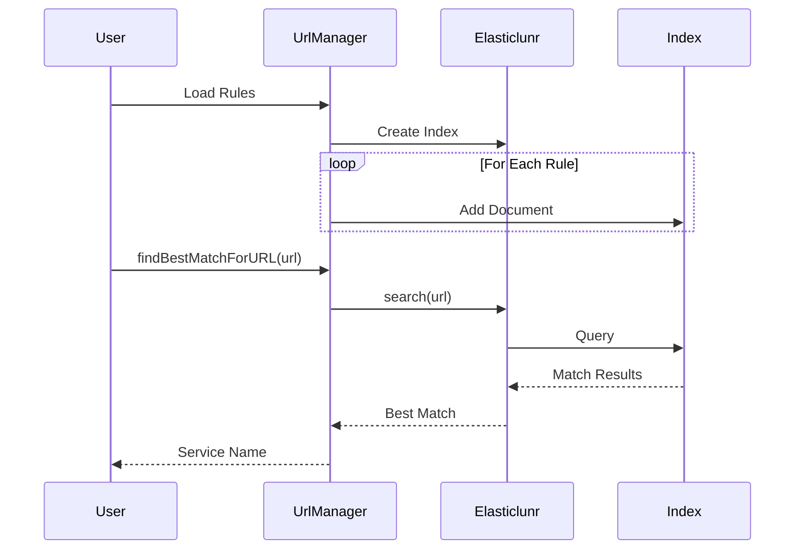

# Full Text Search

A Node.js demonstration application showcasing full-text search capabilities using Elasticlunr.js for URL pattern matching. This project demonstrates how to efficiently match URLs against a set of rules with wildcard support.

Built in November 2018. A practical example of implementing a full-text search engine for URL classification and matching.

## Features

- 🔍 Full-text search indexing using Elasticlunr.js
- 🌐 URL pattern matching with wildcard support
- 🎯 Best match algorithm for overlapping patterns
- ⚡ Fast lookup performance with indexed search
- 📝 Simple rule-based configuration
- 🧪 Built-in test cases for validation

## Architecture



## Flow Diagram



## Getting Started

### Prerequisites

- Node.js (v12 or higher)
- npm

### Installation

1. Clone the repository:
```bash
git clone https://github.com/orassayag/full-text-search.git
cd full-text-search
```

2. Navigate to the server directory:
```bash
cd server
```

3. Install dependencies:
```bash
npm install
```

### Running the Application

```bash
npm start
```

This will run the demo with predefined URL rules and test cases, showing how the search engine matches URLs to their corresponding services.

## Usage Example

The application includes example rules for common services:

```javascript
const setOfRules = {
    'www.facebook.com/connect.js': 'Facebook',
    'www.google-analytics.com/*': 'Google Analytics',
    'www.twitter.com/scripts/v1/index.js': 'Twitter'
};
```

When you query a URL like `www.facebook.com/connect.js`, the engine returns `Facebook`.

## Project Structure

```
full-text-search/
├── server/
│   ├── core/
│   │   └── urlManager.js      # URL rules and test cases
│   ├── models/
│   │   └── UrlManager.js      # URL matching logic
│   ├── index.js               # Entry point
│   └── package.json
└── README.md
```

## How It Works

1. **Indexing Phase**:
   - URL rules are loaded and indexed using Elasticlunr
   - Each rule gets a unique ID and is stored as a document

2. **Search Phase**:
   - Input URL is queried against the index
   - Search engine returns relevance scores for all matching rules
   - The rule with the highest score is selected

3. **Result**:
   - Returns the name/tag associated with the best matching rule
   - Supports exact matches and wildcard patterns

## Configuration

To customize URL rules, edit `server/core/urlManager.js`:

```javascript
const setOfRules = {
    'your.domain.com/path': 'Your Service',
    'another.domain.com/*': 'Another Service'
};
```

## Built With

* [Node.js](https://nodejs.org/en) - JavaScript runtime
* [Elasticlunr.js](http://elasticlunr.com/) - Lightweight full-text search engine
* [ESLint](https://eslint.org/) - Code quality and style checking
* [Git](https://git-scm.com) - Version control

## Use Cases

- URL classification and categorization
- Third-party script detection
- Analytics tracking identification
- Content delivery network (CDN) recognition
- API endpoint routing

## Contributing

Contributions to this project are [released](https://help.github.com/articles/github-terms-of-service/#6-contributions-under-repository-license) to the public under the [project's open source license](LICENSE).

Everyone is welcome to contribute. Contributing doesn't just mean submitting pull requests—there are many different ways to get involved, including answering questions and reporting issues.

Please feel free to contact me with any question, comment, pull-request, issue, or any other thing you have in mind.

See [CONTRIBUTING.md](CONTRIBUTING.md) for details.

## Author

* **Or Assayag** - *Initial work* - [orassayag](https://github.com/orassayag)
* Or Assayag <orassayag@gmail.com>
* GitHub: https://github.com/orassayag
* StackOverflow: https://stackoverflow.com/users/4442606/or-assayag?tab=profile
* LinkedIn: https://linkedin.com/in/orassayag

## License

This application has an MIT license - see the [LICENSE](LICENSE) file for details.
